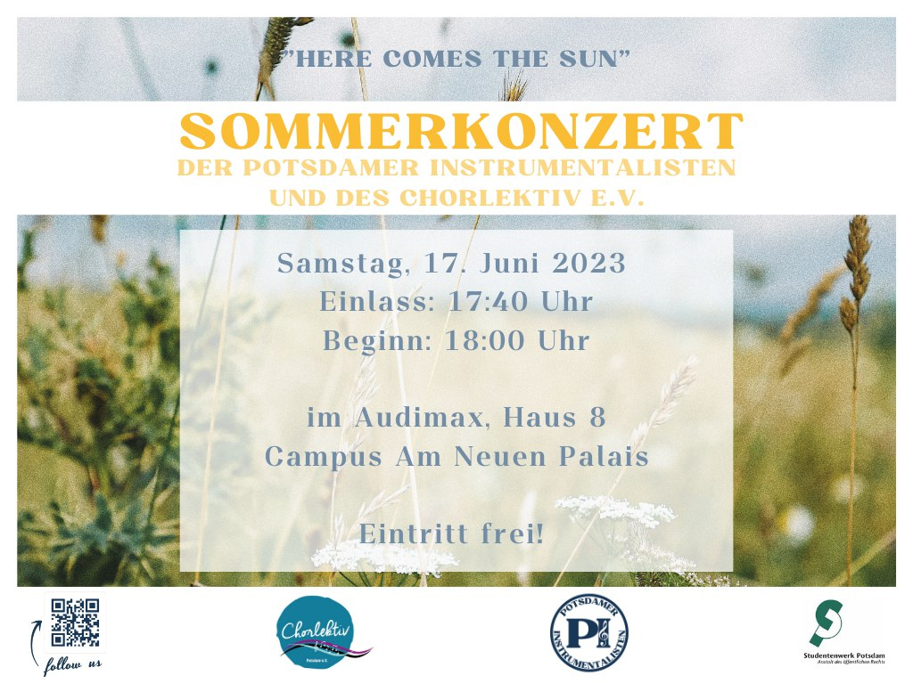

Wir laden euch herzlich zu unserem Sommerkonzert am 17. Juni um 18:00 Uhr im Audimax ein!

Gemeinsam mit dem Chorlektiv Potsdam e.V. gestaltet die Hochschulgruppe Potsdamer Instrumentalisten ein bunt gemischtes Konzertprogramm. Euch erwartet ein kurzweiliger Abend mit klassischen und modernen Klängen von Chor und Blasorchester. Der Einlass beginnt um 17:40, nach der Hälfte des Konzerts wird es eine Getränkepause geben.

Der Eintritt ist frei, um Spenden wird gebeten.

 

--- 

## Wer wir sind

Wir sind die Potsdamer Instrumentalisten: 
Eine Hochschulgruppe der [Universität Potsdam](https://www.uni-potsdam.de/de/organisation/weitere-einrichtungen/eingetragene-vereinigungen.html) von Studierenden für Studierende. 
Wir schaffen ein Umfeld, in dem Musiker*innen verschiedenster Fachrichtungen seit 2018
zwanglos zusammen musizieren können, da bei uns Spaß im Vordergrund steht.
Alle sind in unserem Orchester willkommen, denn:

**WIR SUCHEN DICH!**

 

---

 
Unser Ziel ist das gemeinsame Musizieren!
Bei uns ist grundsätzlich jede Person willkommen, die bereits ein Instrument spielen kann.
Es ist dabei zweitrangig, ob Du an der Universität Potsdam studierst!
Wenn Du Interesse hast, bei uns mitzumachen, dann [kontaktiere](/kontakt) uns!  
Wir sind immer auf der Suche nach neuen Instrumentalisten.
In unserem [Kalender](/kalender) findest du immer die aktuellen Termine unserer Hochschulgruppe und [Ensembles](#ensembles).
Das erforderliche Können hängt dabei vom jeweiligen Ensemble ab.  
Aktuell ist kein passendes Ensemble dabei, aber Du hast eine Idee für ein neues Ensemble?
Dann kontaktiere uns und zusammen sehen wir, was möglich ist!

 

---

 
## Ensembles

#### Blasorchester

Das Orchester besteht aktuell aus Musizierenden, die vorallem aus den Naturwissenschaften kommen.
In der Regel spielen wir moderne Unterhaltungsmusik im mittleren Schwierigkeitsgrad.
Dazu gehören Filmmusik, Arrangements aus der Pop-Musik und originale Werke für Blasorchester.

Grundsätzlich sind alle Instrumente willkommen, die zum Blasorchester gehören.<!-- 
Besonders freuen wir uns über Unterstützung in der tiefen Fraktion, das heißt Tuben und Euphonien -->
Wenn Du also Lust hast mitzumachen, dann kontaktiere uns über die [Kontakt](/kontakt)-Seite.
Die aktuellen Proben findest Du im [Kalender](/kalender). 

Hinweis an das Schlagwerk: Wir freuen uns auch über euch.
Allerdings können wir keine Instrumente stellen und nichts in der Universität lagern.
